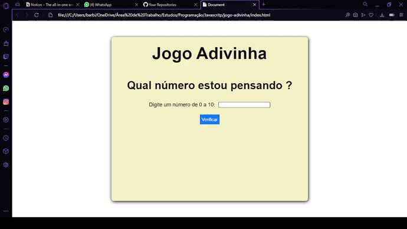

# Jogo Adivinha

No jogo você irá digitar números de 0 a 10 para tentar acertar.

Em caso de acerto ou erro, irá aparecer uma mensagem na tela informando sobre o resultado.

Adicionei funcionalidades para verificar se o número era válido.

Outra validação que coloquei era se algum número foi digitado.

Foi muito bom para entender melhor as funcionalidades do IF and ELSE IF, e integrar com a parte visual de uma página e a interação com usuário.

